# Exemplary models

## Rayleigh 

Cloud-free Rayleigh scattering atmosphere

- Planetary radius: $7 \times 10^7$ m
- Height of the atmosphere: $100$ km
- Distance to star: $0.1$ au
- Distance to observer: $10$ pc
- Composition: Molecular hydrogen
- Wavelength: $550$ nm
- Scattering optical depth: $1$
- Absorbing surface

Phase curve (flux normalized to the geometric albedo) of the exemplary model:

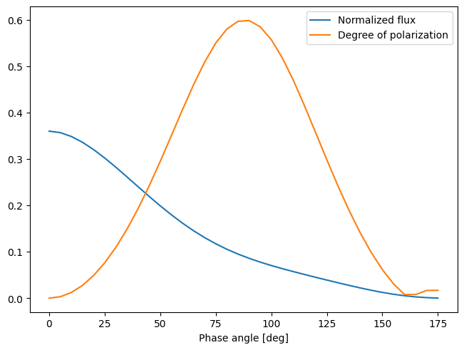

## Methane 

Cloud-free Rayleigh scattering atmosphere with absorbin methane

- Planetary radius: $7 \times 10^7$ m
- Height of the atmosphere: $100$ km
- Distance to star: $0.1$ au
- Distance to observer: $10$ pc
- Composition: Molecular hydrogen, absorbing methane
- Wavelength: $550$ nm
- Scattering optical depth: $1$
- Absorbing surface

Spectrum (flux normalized to the geometric albedo) of the exemplary model:

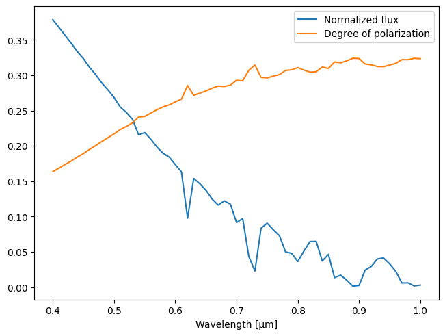

## Ocean 

Cloud-free Rayleigh scattering atmosphere with an ocean surface

- Planetary radius: $7 \times 10^7$ m
- Height of the atmosphere: $100$ km
- Distance to star: $0.1$ au
- Distance to observer: $10$ pc
- Composition: Molecular hydrogen
- Wavelength: $550$ nm
- Scattering optical depth: $0.1$
- Water ocean surface, wind speed: $10$ m/s

Phase curve (flux normalized to the geometric albedo) of the exemplary model:

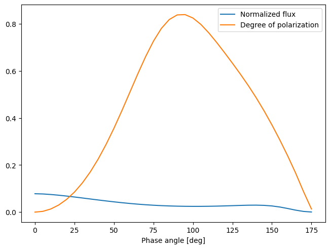

Flux and polarization map of the exemplary model:

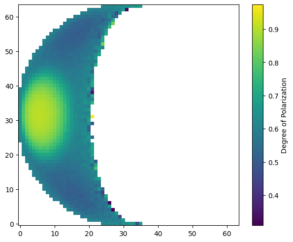

## Cloudy

Cloudy atmosphere

- Planetary radius: $7 \times 10^7$ m
- Pressure logarithmically from $10$ bar to $10^{-5}$ bar, clouds between $1$ bar and $0.1$ bar
- Distance to star: $0.1$ au
- Distance to observer: $10$ pc
- Composition: Molecular hydrogen, Water clouds
- Cloud size distribution: $n(r) \propto r^a \exp(-r/b)$, where $a = 7$ and $b = 0.2$ µm
- Wavelength: $550$ nm
- Cloud optical depth: $1$
- Absorbing surface

Phase curve (flux normalized to the geometric albedo) of the exemplary model:

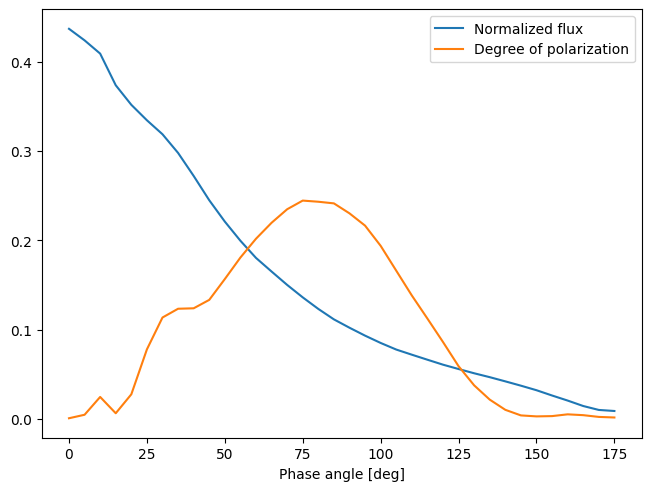

# Ringed

Ringed cloud-free planet

- Planetary radius: $7 \times 10^7$ m
- Height of the atmosphere: $100$ km
- Ring from $1.2$ to $2.3$ planetary radii, opening angle: $0.2$ arcsec
- Ring inclined by $25$° to both observer and star
- Distance to star: $0.1$ au
- Distance to observer: $10$ pc
- Composition: Molecular hydrogen, Astronomical silicate in the ring
- Dust grains size distribution: $n(r) \propto r^a$, where $a = -3$ and $0.1$ µm $< r <$ $10$ µm
- Wavelength: $550$ nm
- scattering optical depth: $1$, vertical ring optical depth: $1$
- Absorbing surface

Flux and polarization map of the exemplary model:

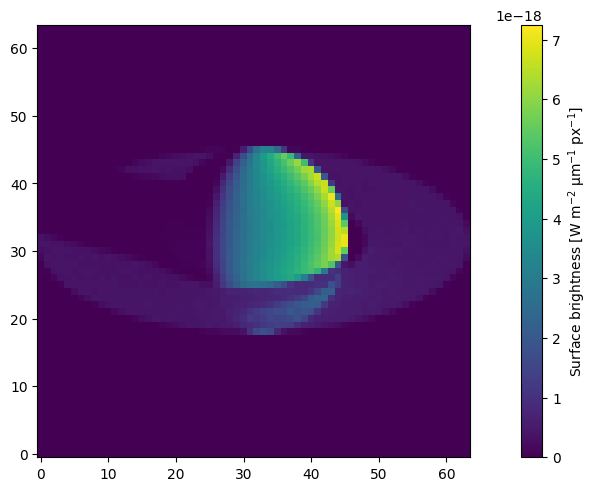
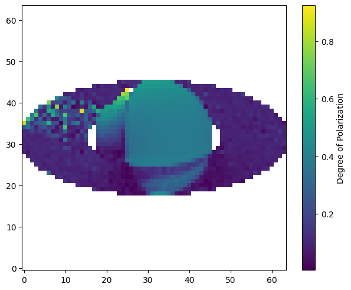

# Venus

Venus-like cloudy atmosphere

- Planetary radius: $6.05 \times 10^6$ m
- Height of the atmosphere: $150$ km
- Clouds between $50$ km and $70$ km
- Distance to star: $0.7282$ au
- Distance to observer: $1$ pc
- Composition: Carbon dioxide, Sulfuric acid clouds
- Cloud size distribution: $n(r) \propto r^a \exp(-r/b)$, where $a \approx 11.2857$ and $b = 0.0735$ µm
- Cloud optical depth: $30$
- Absorbing surface

Degree of polarization at various wavelengths compared with observations:

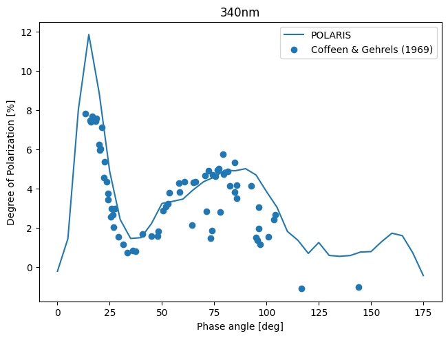
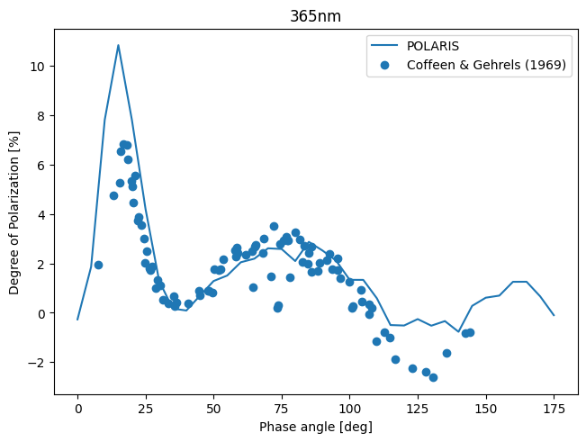
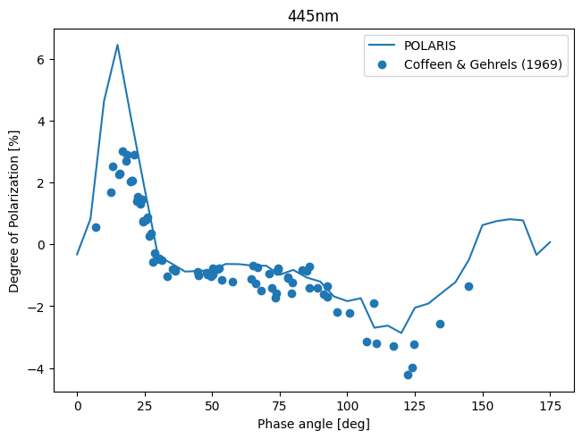
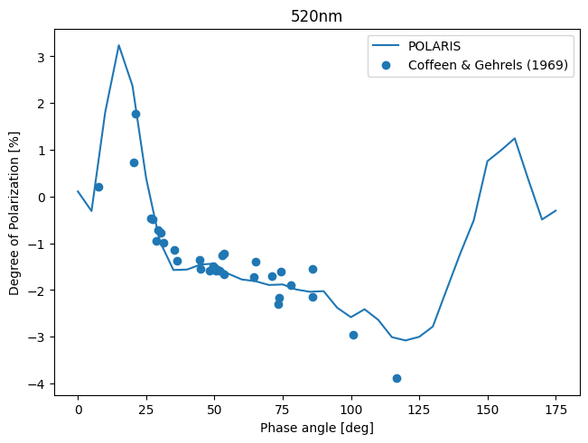
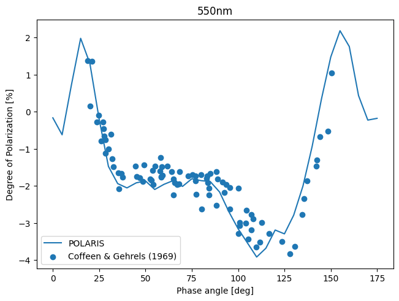
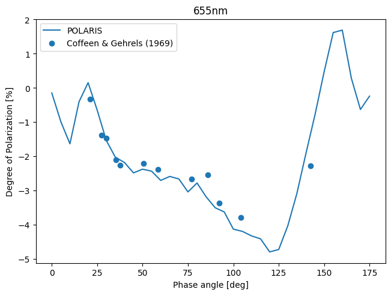
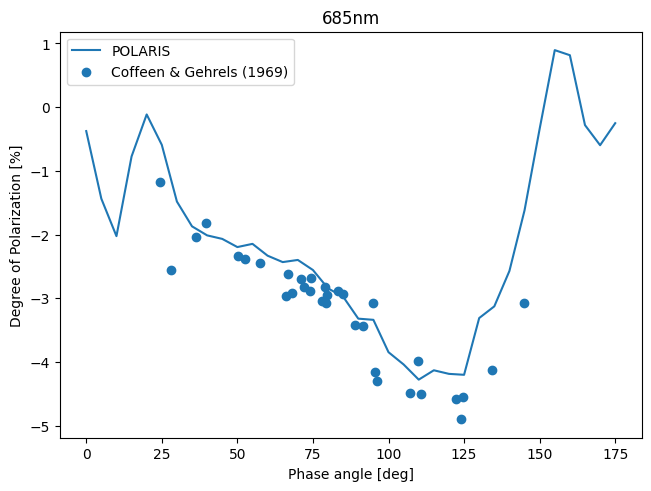
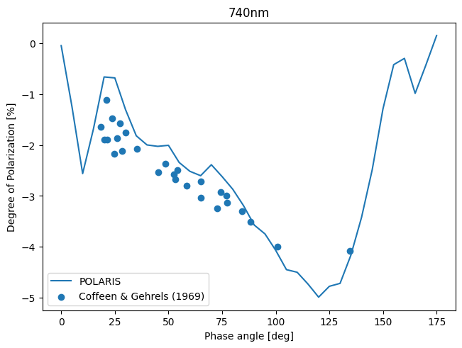
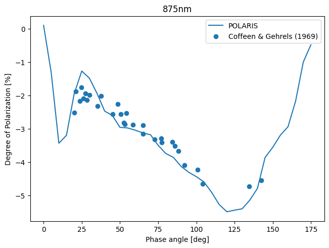
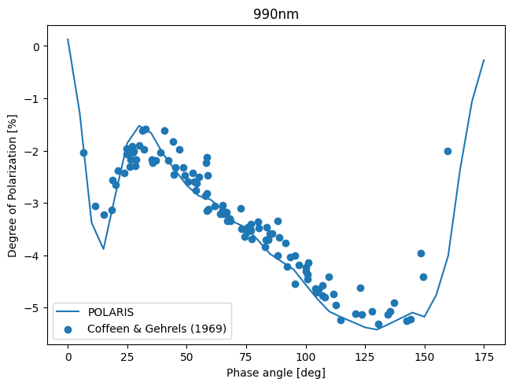
