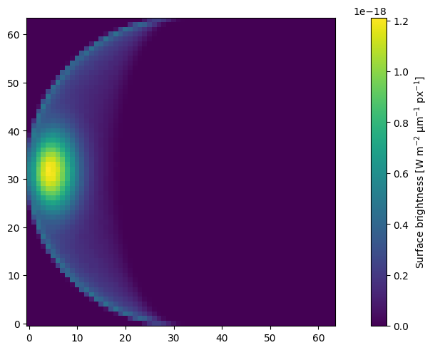

# Exemplary models

## Rayleigh 

Cloud-free Rayleigh scattering atmosphere

- Planetary radius: $7 \times 10^7\ \rm m$
- Height of the atmosphere: $100\ \rm km$
- Distance to star: $0.1\ \rm au$
- Distance to observer: $10\ \rm pc$
- Composition: Molecular hydrogen
- Wavelength: $550\ \rm nm$
- Scattering optical depth: $1$
- Absorbing surface

Phase curve (flux normalized to the geometric albedo) of the exemplary model:

## Methane 

Cloud-free Rayleigh scattering atmosphere with absorbin methane

- Planetary radius: $7 \times 10^7\ \rm m$
- Height of the atmosphere: $100\ \rm km$
- Distance to star: $0.1\ \rm au$
- Distance to observer: $10\ \rm pc$
- Composition: Molecular hydrogen, absorbing methane
- Wavelength: $550\ \rm nm$
- Scattering optical depth: $1$
- Absorbing surface

Spectrum (flux normalized to the geometric albedo) of the exemplary model:

## Ocean 

Cloud-free Rayleigh scattering atmosphere with an ocean surface

- Planetary radius: $7 \times 10^7\ \rm m$
- Height of the atmosphere: $100\ \rm km$
- Distance to star: $0.1\ \rm au$
- Distance to observer: $10\ \rm pc$
- Composition: Molecular hydrogen
- Wavelength: $550\ \rm nm$
- Scattering optical depth: $0.1$
- Water ocean surface, wind speed: $10\ \rm m/s$ (see e.g., [Zhai et al. 2010](https://ui.adsabs.harvard.edu/abs/2010JQSRT.111.1025Z))

Phase curve (flux normalized to the geometric albedo) of the exemplary model:

Flux and polarization map of the exemplary model:

## Cloudy

Cloudy atmosphere

- Planetary radius: $7 \times 10^7\ \rm m$
- Pressure logarithmically from $10\ \rm bar$ to $10^{-5}\ \rm bar$, clouds between $1\ \rm bar$ and $0.1\ \rm bar$
- Distance to star: $0.1\ \rm au$
- Distance to observer: $10\ \rm pc$
- Composition: Molecular hydrogen, Water clouds
- Cloud size distribution: $n(r) \propto r^a \exp(-r/b)$, where $a = 7$ and $b = 0.2\ \rm µm$
- Wavelength: $550\ \rm nm$
- Cloud optical depth: $1$
- Absorbing surface

Phase curve (flux normalized to the geometric albedo) of the exemplary model:

# Ringed

Ringed cloud-free planet

- Planetary radius: $7 \times 10^7\ \rm m$
- Height of the atmosphere: $100\ \rm km$
- Ring from $1.2$ to $2.3$ planetary radii, opening angle: $0.2\ \rm arcsec$
- Ring inclined by $25\degree$ to both observer and star
- Distance to star: $0.1\ \rm au$
- Distance to observer: $10\ \rm pc$
- Composition: Molecular hydrogen, Astronomical silicate in the ring
- Dust grains size distribution: $n(r) \propto r^a$, where $a = -3$ and $0.1\ {\rm µm} \leq r \leq 10\ \rm µm$
- Wavelength: $550\ \rm nm$
- scattering optical depth: $1$, vertical ring optical depth: $1$
- Absorbing surface

Flux and polarization map of the exemplary model:

# Venus

Venus-like cloudy atmosphere

- Planetary radius: $6.05 \times 10^6\ \rm m$
- Height of the atmosphere: $150\ \rm km$
- Clouds between $50\ \rm km$ and $70\ \rm km$
- Distance to star: $0.7282\ \rm au$
- Distance to observer: $1\ \rm pc$
- Composition: Carbon dioxide, Sulfuric acid clouds
- Cloud size distribution: $n(r) \propto r^a \exp(-r/b)$, where $a \approx 11.2857$ and $b = 0.0735\ \rm µm$ ([Hansen & Hovenier 1974](https://ui.adsabs.harvard.edu/abs/1974JAtS...31.1137H))
- Cloud optical depth: $30$
- Absorbing surface

Degree of polarization at various wavelengths compared to observations by [Coffeen & Gehrels (1969)](https://ui.adsabs.harvard.edu/abs/1969AJ.....74..433C):

